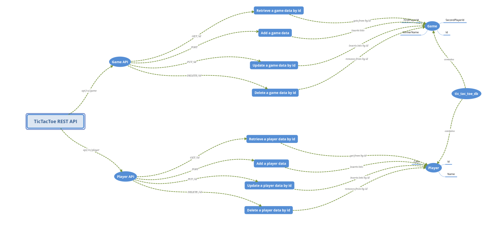

# Web API for Tic-Tac-Toe game

## This API uses to manage data of the two entities: players and games

## Game entity has both players Ids from player entity

### Player entity:

- Address: api/v1/player
- API-methods:
  - /get/{id} - receives a player object by id
  - /get - receives all players' objects
  - /create - adds a new player object
  - /update - replaces an old player object by new one
  - /delete/{id} - removes a player object by id

### Game entity:

- Address: api/v1/game
- API-methods:
  - /get/{id} - receives a game object by id
  - /get - receives all games' objects
  - /create - adds a new game object
  - /update - replaces an old game object by a new one
  - /delete/{id} - removes a player object by id

## Warning:
### This API doesn't check the correctness of the given params like:
- Existence of players with given ids in a game record
- The situation when both players' ids are equal in one game record
- The situation when both players' cells are invalid (cells' values interception)

### All of these situations are not being checked because I believe that such checks should be realized by a client's programs that uses this API
### But I also believe that here is a field for discussions so I'll be glad to get an another point of view

## Here is a little non-professional structure of this API
